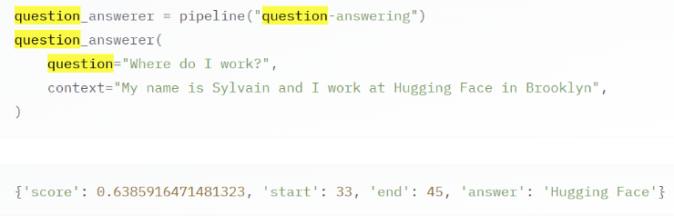
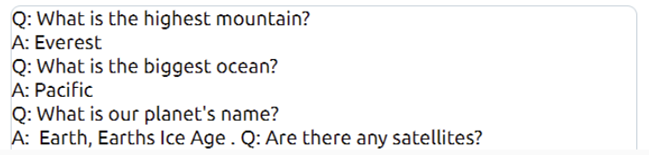
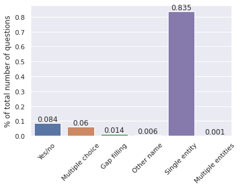
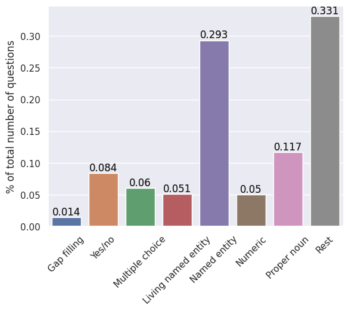

# Closed-Book QA

Python scripts to run model training and testing for different revisions.  
Artur Sokol

---

## Table of contents

1. [About Closed-book QA](#briefly-about-the-problem)
2. [How to use the main script](#main-script)
    1. [General help](#general-help)
    2. [Environment setup notes](#note-about-the-environment)
    3. [Main script usage examples](#examples)
    4. [Results](#results)
    5. [Evaluation](#evaluation)
3. [Utilities](#utilities)
    1. [Custom PolEval filters](#grouping-poleval-questions-using-filters)
    2. [Administration commands](#admin-commands)
4. [Experiments iterations](#experiments-iterations)
    1. [#0](#iteration-0)
    2. [#1](#iteration-1)

... [TODO]

---

## Briefly about the problem
Closed-book Question Answering means that a trained model in order to answer on a question does not need any provided context - it uses its own knowledge:

|  |  |
| :----: | :----: |
| Machine Reading Comprehension (MRC) | Closed-book QA |

On the contrary, Open-book QA uses an external source of knowledge (e.g. a DB of Wikipedia articles in raw format). In this case an Open-book QA model searches for _k_ best matching documents and then uses MRC to extract the answer


## Main script

### General help
```
usage: main.py [-h] -n {plt5,papugapt2} -r {baseline} -b BASE_DATA_PATH -t TOKENIZER_PATH -m MODEL_PATH
               [-q QUESTION_MAX_LENGTH] [-a ANSWER_MAX_LENGTH] [-o TRAINING_OUTPUT_DIR]
               [--test-batch-size TEST_BATCH_SIZE] [--test-max-length TEST_MAX_LENGTH] [--results-dir RESULTS_DIR]
               [-s] [-S] [-f]

optional arguments:
  -h, --help            show this help message and exit
  -n {plt5,papugapt2}, --model_name {plt5,papugapt2}
                        a model name to use. In this master thesis most likely T5 and GPT2 only will be considered
  -r {baseline}, --revision {baseline}
                        model revision, the names might be weird as they should follow Python naming conventions
  -b BASE_DATA_PATH, --base-data-path BASE_DATA_PATH
                        base path to all data. Every kind of data should be placed there. Right now their names are hardcoded: test-A, test-B, train
  -t TOKENIZER_PATH, --tokenizer-path TOKENIZER_PATH
                        can be a name on huggingface or a local path
  -m MODEL_PATH, --model-path MODEL_PATH
                        can be a name on huggingface or a local path. If a local path, then it's most likely already fine-tuned and it's good to use `-S` flag too
  -q QUESTION_MAX_LENGTH, --question-max-length QUESTION_MAX_LENGTH, --q-maxlen QUESTION_MAX_LENGTH
                        max length for a tokenized question, during training
  -a ANSWER_MAX_LENGTH, --answer-max-length ANSWER_MAX_LENGTH, --a-maxlen ANSWER_MAX_LENGTH
                        max length for a tokenized answer, during training
  -o TRAINING_OUTPUT_DIR, --training-output-dir TRAINING_OUTPUT_DIR
                        path to outputs during model training. Be careful, as the default path is one level up than
                        models and their revisions, thus would be overwritten for every program run
  --test-batch-size TEST_BATCH_SIZE
                        batch size during testing
  --test-max-length TEST_MAX_LENGTH
                        max length necessary to create a pytorch tensor during testing
  --results-dir RESULTS_DIR
                        the name of a directory where results of testing would be stored. Its path is combined of the current working directory, model name (-n parameter) and revision (-r)
  -s, --save-pretrained
                        a flag to signal whether to save a fine-tuned model locally. If set then the model will be saved under "./{model_name}/{revision}/trained-model"
  -S, --skip-training
                        a model is not going to be trained
  -f, --few-shot        for decoder-based models performs testing in a few-shot way. If set for a model name/revision which does not have implemented few-shot, then the flag is just ignored
```

### Note about the environment
When running plT5 one more library should be installed:
```bash
$ pip install sentencepiece
```


### Examples

for plT5:
```
python main.py -n plt5 -r baseline -b data/poleval -t allegro/plt5-small -m allegro/plt5-small --results-dir ./plt5-results
```
or for papuGaPT2:
```
python main.py -S -n papugapt2 -r baseline -q 45 -a 10 -b data/poleval -t dkleczek/papuGaPT2 -m dkleczek/papuGaPT2 --results-dir papugapt2-results --test-batch-size 250 --few-shot
```

### Results
For results description (metrics, generated data by models) go to README.md under respective model names.


### Evaluation
For this purpose [geval](https://gitlab.com/filipg/geval) is used, because the testing data is taken from [PolEval-2021 task 4](https://github.com/poleval/2021-question-answering/tree/secret), where geval was used for evaluation. Moreover the tool is easy to use and it has a lot of different supported metrics.

```bash
$ ./geval --list-metrics  # outputs the complete list of available metrics and their description
$ ./geval -t <path-to-results-dir> --metric GLEU --metric Accuracy [--metric ...]  # evaluate results
$ ./geval -t <path-to-results-dir> --alt-metric <metric> --line-by-line --reverse-sort | less  # inspect every actual-expected pair sorted by the most accurate
```


## Utilities

### Grouping PolEval questions using filters
Currently, there have been implemented seven filters for PolEval questions which are aimed to help with preprocessing (specifically, natural language _prompting_). The original distribution suggested by the authors of the dataset is very unbalanced, which can cause difficulties during training and make a trained model biased towards specific questions categories.



The implemented filters do not completely solve the problem, but now the disbalance is not so abrupt.



Some of the filters are **overlapping**, which means that when calling suggested `split_data_by_filters()` function, the order of passing the filters as key args does affect the final distribution. Another thing which causes this behaviour is that each new filter is applied only to the unfiltered part of the data. An example of how to use the grouping function and `plot_questions_distribution_into_file()` function:

```py
from utils import plot_questions_distribution_into_file
from utils import data_preprocess as prep

split_subsets = prep.split_data_by_filters(data, fill_gap=prep.fill_gap_filter, boolean=prep.boolean_filter, mchoice=prep.multiple_choice_filter, named_living=prep.living_entity_filter, named_entity=prep.named_entity_filter, numeric=prep.
numeric_entity_filter, proper_noun=prep.propn_filter)

plot_questions_distribution_into_file(split_subsets, prep.QUESTION_TYPES, 'train_subsets_dist.png')
```

### Admin commands

Under `admin/` package, there can be placed own implementations of administration utilities for processing available data. There are two available now - utilities for PolEval dataset and the Polish subset of MKQA dataset. Every possible dataset utilities command implementation must be a nested Python package with the prepared `ArgumentParser` instance, which defines all necessary arguments. The function which returns this instance should look like this:

```py
# in __init__.py
from argparse import _SubParsersAction


def prepare_arg_parser(subparsers: _SubParsersAction):  # subparsers is passed by run_command.py
  parser = subparsers.add_parser('-s poleval')
  parser.add_argument(...)
  # other arguments/argument groups
  return parser 
```

Near `__init__.py`, there should be `command.py` with `main(args)` function. It is too, called from `run_command.py`. Using `run_command.py` is following:

```bash
$ python run_command.py [-l | --list]  # lists available implementations under admin/
# like this:
# python run_command.py -l
#   poleval
#   mkqa_pl

$ python run_command.py [-s | --source] poleval -h  # prints help for this utility commands provider
# like this:
#
# usage: run_command.py -s poleval [-h] [-p | -g | -a] [-n NDUPLICATES] -d DIRECTORY -t TARGET_PATH
#
# optional arguments:
#  -h, --help            show this help message and exit
#  -p, --prompts         append prompts to all questions and answers from the same pool
#  -g, --gprompts        split questions on groups and each group has its own pool of prompts
#  -a, --artificial      enclose questions and answers by an artificial suffix and a prefix
#  -n NDUPLICATES, --nduplicates NDUPLICATES
#                       number of possible duplicates of every data item. 0 means only the original item
#  -d DIRECTORY, --directory DIRECTORY
#                       source directory with all available PolEval subsets
#  -t TARGET_PATH, --target_path TARGET_PATH
#                       destination path of the processed dataset
```

## Experiments iterations
Every data iteration is described under this section. Data iteration means a separate bunch of already preprocessed and merged into one datasets which is used to train and evaluate models. Every iteration description contains a list of administration script (`run_command.py`, see [here](#admin-commands)) runs, including preprocessing and final merge into one set of train, dev and test subsets in the PolEval format. `./data-iterations/#-{iteration-name}` from the scripts is the format which was used to store final datasets for each iteration.

### Iteration #0
Only PolEval and little preprocessed MKQA are used here.

### Iteration #1
PolEval + min-MKQA and one more dataset are used here.